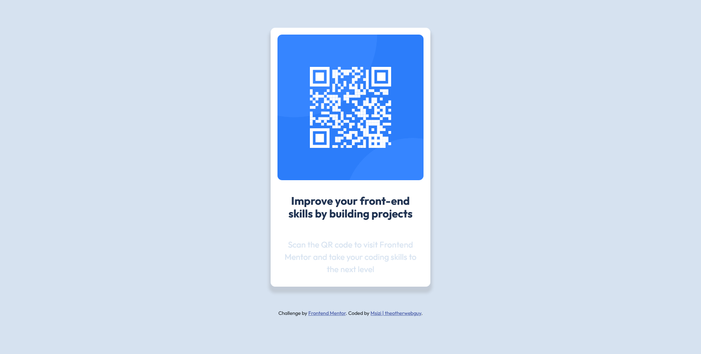

# Frontend Mentor - QR code component

## Welcome! 👋

Thanks for checking out this front-end coding challenge.

[Frontend Mentor](https://www.frontendmentor.io) challenges help you improve your coding skills by building realistic projects.

**To do this challenge, you need a basic understanding of HTML and CSS.**

## The challenge

Your challenge is to build out this QR code component and get it looking as close to the design as possible.

You can use any tools you like to help you complete the challenge. So if you've got something you'd like to practice, feel free to give it a go.

Want some support on the challenge? [Join our Slack community](https://www.frontendmentor.io/slack) and ask questions in the **#help** channel.

# Frontend Mentor - QR code component solution

This is a solution to the [QR code component challenge on Frontend Mentor](https://www.frontendmentor.io/challenges/qr-code-component-iux_sIO_H). Frontend Mentor challenges help you improve your coding skills by building realistic projects. 

### Screenshot
/

### Links

- Solution URL: (https://github.com/theotherwebguy/QR-code-component)
- Live Site URL: (https://codepen.io/msizi/project/editor/XrJeJg)

### Built with

- Semantic HTML5 markup
- Bootstrap
- SCSS
- Flexbox
- Mobile-first workflow

### What I learned

- I learned how to make a responsive design from all screen sizes including landscape orientation.
- I learned the importance of using corrent html semantics to increase accessibility

## Author

- LinkedIn - [Msizi ](https://www.linkedin.com/in/msizi-ndlela)
- Frontend Mentor - [@msizi67494](https://www.frontendmentor.io/profile/msizi67494)

